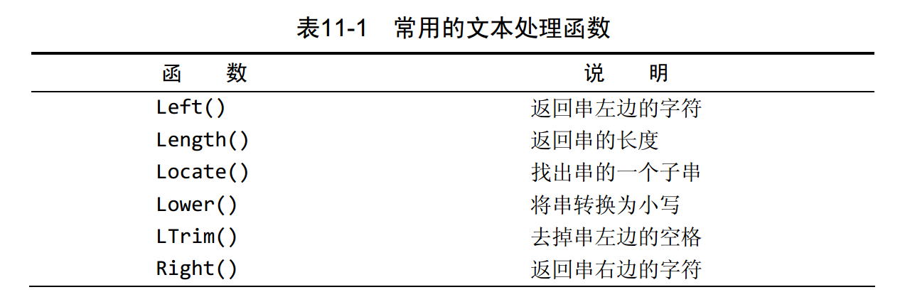
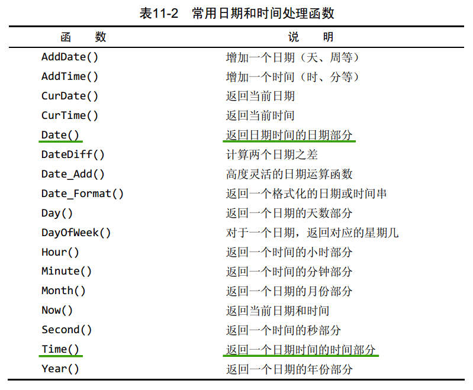
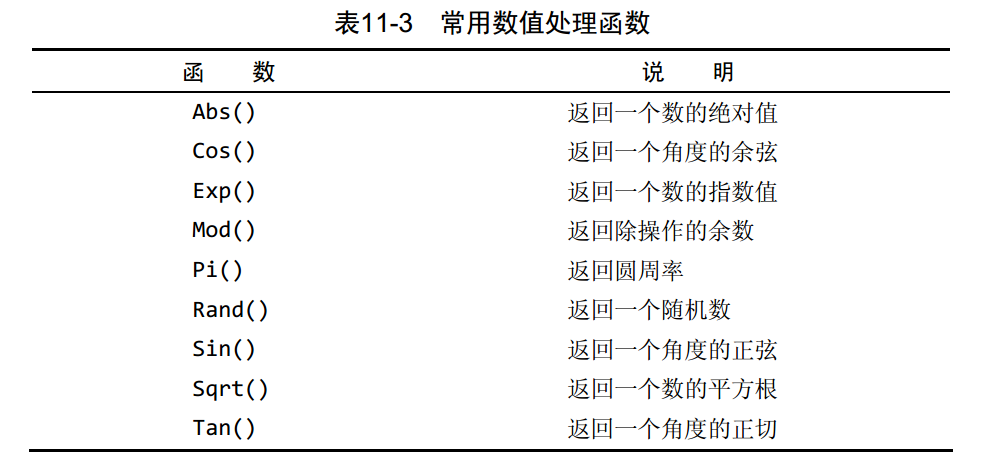
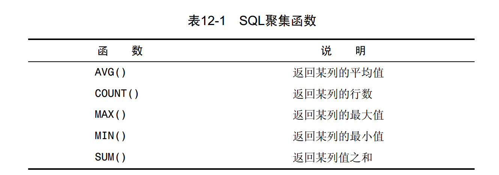
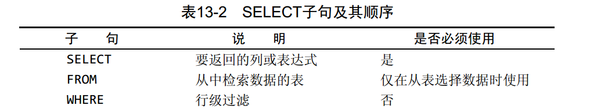
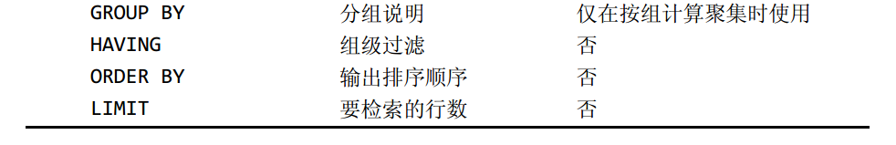

## 前言

1️⃣  ：[mysql环境准备](https://blog.csdn.net/sinat_38816924/article/details/105478479)

2️⃣  ：[简单的表查询](https://blog.csdn.net/sinat_38816924/article/details/105718525)

:three: ：[通配符+正则表达式](https://blog.csdn.net/sinat_38816924/article/details/105737660)

第一部分：我们准备环境：安装数据库+创建数据库+创建用户+授权。

第二部分：环境准备好后，进行简单的单表查询：导入表+表查询。

第三部分：通配符和正则表达式，增强where的筛选功能。

现在是第四部分：参考《sql必知必会》chapter10~13，**字段+函数+分组**。

增强查询列那部分功能和对查询进行分组汇总。

---

[toc]

## 摘要与总结

有时候，我们并不是希望直接将列返回。而是将列，进行计算处理。

这里处理过程，如果放在服务器端，我们把这个列称为**字段**。在客户端看来，字段和列完全没区别。

当列处理过程比较复杂的时候，我们引入了**函数**。

有的操作函数是整理总结类型。按照不同组汇总，进行**分组**操作。

顺其自然的对比，行过滤(where)和分组过滤(having)的区别。默认情况是所有行是不同的组。WHERE过滤行，而HAVING过滤分组。


## 字段

字段（field） 基本上与列（ column） 的意思相同，经常互换使用。

```mysql
# 比如我们想得到总价格。数据库中没有直接存储，但是可以计算得出
mysql> select num*price from products;
```

`num*prict` 就是字段啦。

只有数据库知道SELECT语句中哪些列是实际的表列，哪些列是计算字段。从客户机（如应用程序）的角度来看，计算字段的数据是以与其他列的数据相同的方式返回的。

当然，我们可以把数据传回客户端，在客户端进行处理。

> 但一般来说，在数据库服务器上完成这些操作比在客户机中完成要快得多，因为DBMS是设计来快速有效地完成这种处理的。


<font color=blue>关于字段处理：计算字段、拼接字段、使用别名</font>

```mysql
# 计算字段，使用别名
mysql> select num*price AS total_price from products;
# 拼接字段，把商家名和商家地址，按照“商家(地址)”格式输出
mysql> SELECT concat(vend_name,'(',vend_address,')') FROM vendors;
```

<br>

<br>

## 函数

上面有对字段的计算。但是当计算比较复杂的时候，咋整？

晓过编程语言的都知道，要用函数。

即：<font color=blue>当操作这个字段比较复杂的时候，直接操作就不合适了。所以必须引进函数。处理文本、处理日期时间、数值处理。</font>

函数这里被分成两类：**数据处理函数、汇总函数**

### 数据处理函数

1. 文本处理函数

   


2. 日期处理函数




3. 数值处理函数

   


**看到这里，我们顺道会想到，能否使用自定义的函数，以及如何使用。**

当然可以。可以参考下面这两篇文章。

[数据库之自定义函数](https://zhuanlan.zhihu.com/p/101591656)
[函数与存储过程](https://fqk.io/mysql-proceduce-function-diff/)

但是

> 函数的可移植性却不强。几乎每种主要的DBMS的实现都支持其他实现不支持的函数，而且有时差异还很大。
>
> 为了代码的可移植，许多SQL程序员不赞成使用特殊实现的功能。虽然这样做很有好处，但不总是利于应用程序的性能。如果不使用这些函数，编写某些应用程序代码会很艰难。必须利用其他方法来实现DBMS非常有效地完成的工作。
>
> 如果你决定使用函数，应该保证做好代码注释，以便以后你（或其他人）能确切地知道所编写SQL代码的含义。

<br>

### 汇总数据函数

虽然，汇总数据的函数也是函数，<font color=blue>但是它应该在分组上起作用。</font>

当然它们也可以直接使用。因为默认的是每一行是一个分组。

关于分组的内容，我们放在下一节。暂时不影响理解。

> 我们经常需要汇总数据而不用把它们实际检索出来，为此MySQL提供了专门的函数。使用这些函数， MySQL查询可用于检索数据，以便分析和报表生成。

参考：[help count](https://dev.mysql.com/doc/refman/5.7/en/group-by-functions.html) 、[SQL中distinct的用法](https://www.cnblogs.com/rainman/archive/2013/05/03/3058451.html)




```mysql
# 对所有的价格取平均
mysql> SELECT AVG(prod_price) as avg_prod_price

# 如果一章表中，有相同的产品。我们得过滤下。保证得出的是每个物品的平均价格
# 这里得用下子查询
mysql> SELECT AVG(prod_price) AS avg_prod_price FROM　products                           	 	WHERE prod_name IN(SELECT DISTINCT prod_name FROM products);
```


<br>
<br>

## 分组数据

**分组允许把数据分为多个逻辑组**，以便能对每个组进行聚集计算。（聚集计算使用的是上面“汇总数据函数”）

使用`GROUP BY`创建分组；使用`HAVING`过滤分组；

使用`WITH ROLLUP`时，将会在所有记录的最后加上一条记录。这条记录是上面所有记录的总和。

参考：[MySQL对数据表进行分组查询（GROUP BY）](https://blog.csdn.net/mycms5/article/details/52502323)

```mysql
SELECT vend_id, COUNT(*) AS num_prods
FROM products
GROUP BY vend_id
HAVING COUNT(*)>=2
WITH ROLLUP;　
```

这时候，我们会注意到，<font color=blue>`WHERE` 和`HAVING`都是筛选，它们有什么不同。</font>

* 因为WHERE过滤指定的是行而不是分组。事实上， WHERE没有分组的概念。

* 目前为止所学过的所有类型的WHERE子句都可以用HAVING来替代。唯一的差别是**WHERE过滤行，而HAVING过滤分组**.

* HAVING支持所有WHERE操作符。它们的句法是相同的，只是关键字有差别。

* 当然它们可以同时出现。铁路警察，各管各的。

  ```mysql
  # 列出具有2个（含）以上、价格为10（含）以上的产品的供应商
  SELECT vend_id,COUNT(*) FROM products
  WHERE prod_price>=10
  GROUP BY vend_id
  HAVING COUNT(*)>=2
  ORDER BY vend_id;
  
  # 或者这么写
  SELECT vend_id,COUNT(*) AS vend_nums FROM products
  WHERE prod_price>=10
  GROUP BY vend_id
  HAVING vend_nums>=2
  ORDER BY vend_nums;
  ```

<br>

<br>

## 小总结：SELECT子句顺序





<br>

<br>

## 参考文章

[聊一聊Mysql中的字符串拼接函数](https://juejin.im/post/5ddcd1d1f265da7df62bdfac)

[数据库之自定义函数](https://zhuanlan.zhihu.com/p/101591656)

[函数与存储过程](https://fqk.io/mysql-proceduce-function-diff/)

[聚集函数（ aggregate function）](https://dev.mysql.com/doc/refman/5.7/en/group-by-functions.html)

[SQL中distinct的用法](https://www.cnblogs.com/rainman/archive/2013/05/03/3058451.html)

[MySQL对数据表进行分组查询（GROUP BY）](https://blog.csdn.net/mycms5/article/details/52502323)

[MySQL中DISTINCT与GROUP BY计数原理分析](https://blog.csdn.net/wuxing26jiayou/article/details/78923168)