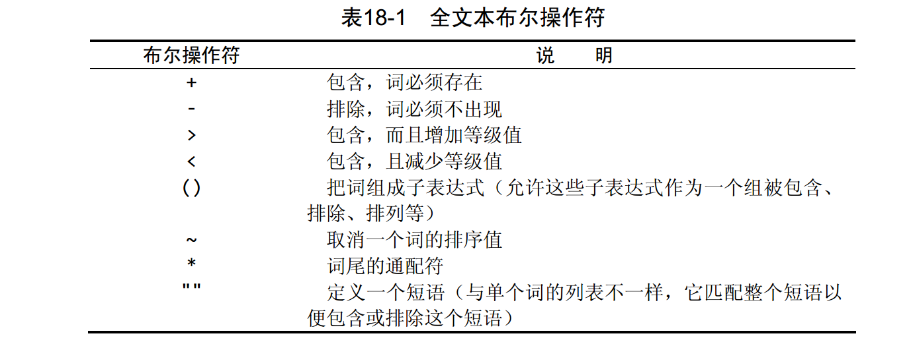

## 前言

1️⃣ ：[mysql环境准备](https://blog.csdn.net/sinat_38816924/article/details/105478479)

2️⃣ ：[简单的表查询](https://blog.csdn.net/sinat_38816924/article/details/105718525)

3️⃣ ：[通配符+正则表达式](https://blog.csdn.net/sinat_38816924/article/details/105737660)

4️⃣ ：[mysql函数与分组](https://blog.csdn.net/sinat_38816924/article/details/105748596)

:five: ：[子查询\_联结查询\_组合查询](https://blog.csdn.net/sinat_38816924/article/details/105775052)

第一部分：我们准备环境：安装数据库+创建数据库+创建用户+授权。

第二部分：环境准备好后，进行简单的单表查询：导入表+表查询。

第三部分：通配符和正则表达式，增强where的筛选功能。

第四部分：对列进行计算处理称为字段。复杂的字段用函数处理。按照不同组汇总，进行分组操作。

第五部分：在多表上进行查询：子查询+联结查询＋组合查询。

现在是第六部分：参考《sql必知必会》第18章，**全文本搜索**。

这一章似乎很强大。我**在这里挖一个坑**。似乎和搜索有关。

google，百度也是搜索，想想是不是很可怕～

我**懒得写**了，明天开始赶毕业设计了，数据库就每天带着看些。

另外书上的内容有些旧了，更正下。

> 从MySQL5.6版本开始支持InnoDB引擎的全文索引，语法层面上大多数兼容之前MyISAM的全文索引模式。所谓全文索引，是一种通过建立倒排索引，快速匹配文档的方式。

---

[toc]

## 总结和摘要

没啥总结的。书上没有提到太多，我没有仔细搜索，遇到再说。

参考文章

[MySQL 5.7 中文全文检索使用教程](https://johng.cn/mysql-5-7-fulltext/)　--->没实践
[MySQL 全文索引实现简单版搜索引擎](https://www.cnblogs.com/YangJiaXin/p/11153579.html#%E4%BD%BF%E7%94%A8%E9%BB%98%E8%AE%A4%E6%96%B9%E5%BC%8F%E5%88%9B%E5%BB%BA%E5%85%A8%E6%96%87%E7%B4%A2%E5%BC%95)　--->没实践
[MySQL InnoDB 中 B+ 树索引，哈希索引，全文索引 详解](https://juejin.im/post/5e7a3346e51d4526cf482467) --->没看

<br>

<br>

## 全文搜索

为了进行全文本搜索，必须索引被搜索的列，而且要随着数据的改变不断地重新索引。在对表列进行适当设计后， MySQL会自动进行所有的索引和重新索引。

在索引之后， SELECT可与Match()和Against()一起使用以实际执行搜索。


### 启动全文本搜索支持

为了进行全文本搜索，MySQL根据子句FULLTEXT(note_text)的指示对它进行索引。

这是创表之处，启动全文本搜索支持。

在表成之后，我们也可以修改表结构，增加“启动全文本搜索支持”。--->我不知道

```mysql
###########################
# Create productnotes table
###########################
CREATE TABLE productnotes
(
  note_id    int           NOT NULL AUTO_INCREMENT,
  prod_id    char(10)      NOT NULL,
  note_date datetime       NOT NULL,
  note_text  text          NULL ,
  PRIMARY KEY(note_id),
  FULLTEXT(note_text)
) ENGINE=MyISAM;
```

<br>

### 进行全文本搜索

在note_text列，搜索兔子：其中Match()指定被搜索的列， Against()指定要使用的搜索表达式。

```mysql
# 在note_text列，搜索兔子
SELECT * FROM productnotes
WHERE match(note_text) against('rabbit');

```

<br>

### 使用扩展查询

查询扩展用来设法放宽所返回的全文本搜索结果的范围，出可能与你的搜索有关的所有其他行，即使它们不包含搜索关键词。

* 首先，进行一个基本的全文本搜索，找出与搜索条件匹配的所有行；
* 其次， MySQL检查这些匹配行并选择所有有用的词（什么是有用？结构关键词相似？）。
* 再其次， MySQL再次进行全文本搜索，这次不仅使用原来的条件，而且还使用所有有用的词

```mysql
SELECT * FROM productnotes
WHERE match(note_text) against('rabbit' WITH QUERY EXPANSION)\G;
```

<br>

### 布尔文本搜索



我们先看示例。

```mysql
# 含词rabbit和bait的行。
SELECT * FROM productnotes
WHERE match(note_text) against('+rabbit +suitable' IN BOOLEAN MODE)\G;

# 含词rabbit和bait至少一个的行。
SELECT * FROM productnotes
WHERE match(note_text) against('rabbit suitable' IN BOOLEAN MODE)\G;

# 这个搜索匹配短语rabbit bait而不是匹配两个词rabbit和bait。
SELECT * FROM productnotes
WHERE match(note_text) against('"rabbit suitable"' IN BOOLEAN MODE)\G;
```

