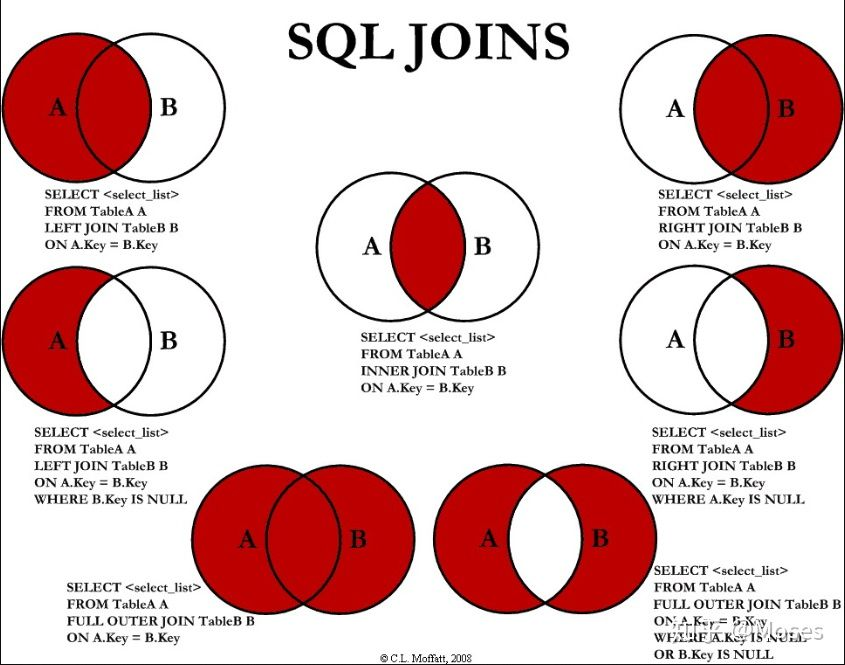

## 前言

1️⃣ ：[mysql环境准备](https://blog.csdn.net/sinat_38816924/article/details/105478479)

2️⃣ ：[简单的表查询](https://blog.csdn.net/sinat_38816924/article/details/105718525)

3️⃣ ：[通配符+正则表达式](https://blog.csdn.net/sinat_38816924/article/details/105737660)

:four: ：[mysql函数与分组](https://blog.csdn.net/sinat_38816924/article/details/105748596)

第一部分：我们准备环境：安装数据库+创建数据库+创建用户+授权。

第二部分：环境准备好后，进行简单的单表查询：导入表+表查询。

第三部分：通配符和正则表达式，增强where的筛选功能。

第四部分：对列进行计算处理称为字段。复杂的字段用函数处理。按照不同组汇总，进行分组操作。

现在是第五部分：参考《sql必知必会》chapter14~16章。**子查询+联结查询＋组合查询**。

之前是对单表进行查询，现在要对多表进行查询。是之前简单表查询的进阶版。

---

[toc]

## 摘要与总结

之前，我们在单表上进行查询。

在多表上，我们可以采用子查询、联结查询。

子查询很灵活，但是效率没有联结查询高。我们推荐使用联结查询。

子查询，嵌套，一层一层写。

联结查询，根据应用场景分为内联结、外联结。

最后，介绍了一个组合查询，可以将多个SELECT语句结果组合成单个结果集。

## 子查询

SQL还允许创建子查询（ subquery） ，即嵌套在其他查询中的查询。

**使用in的子查询：一层一层嵌套，从内向外执行；我们写的时候，也是从内向外，一层一层验证着写。**

```mysql
# 列出订购物品TNT2的所有客户
SELECT * FROM customers
WHERE cust_id IN (SELECT cust_id FROM orders
				WHERE order_num IN (SELECT order_num FROM orderitems 
                                    WHERE prod_id='TNT2'));

```

同样，我们可以用**(等值)联结查询**，来实现上面的功能。（联结查询在下一节）

```mysql
SELECT customers.cust_name, customers.cust_address  
FROM customers,orders,orderitems  
WHERE customers.cust_id=orders.cust_id AND orders.order_num=orderitems.order_num AND orderitems.prod_id='TNT2';
```


或许，我们可以简单看下，子查询与联结查询的速度比较。

参考：[查看mysql语句运行时间](https://blog.csdn.net/qq_29663071/article/details/75021980)


上面查询的时候，内层只用了内层的表。

还有个概念：**相关子查询**。内层查询的时候，会涉及到外部的表。

```mysql
SELECT cust_name,
       (SELECT COUNT(*) FROM orders
        WHERE customers.cust_id=orders.cust_id)
FROM customers
ORDER BY cust_name;
```

<br>

<br>

## 联结查询

在介绍联结查询，之前，我们不得不提，两个概念：关系表＋主键/外键。

> 相同数据出现多次决不是一件好事，此因素是关系数据库设计的基础。**关系表的设计就是要保证把信息分解成多个表，一类数据一个表。**各表通过某些常用的值（即关系设计中的关系（ relational） ）互相关联。

信息被拆分在多个表中，要维持信息的一致性，我们需要主键和外键。

参考：[主键&&外键](https://www.liaoxuefeng.com/wiki/1177760294764384/1218728391867808)

下面介绍的是<font color=red>联结，即把不同(相同)的表合并到一起。</font>

书上是在关系表上，进行联结查询。挺好。

<font color=red>但是，书上没有说：两个没有关系的表，能否进行联结查询。为什么联结查询表子查询快。</font>

我们可以参考网上的一些文章：[图解 SQL 中各种连接 JOIN](https://zhuanlan.zhihu.com/p/46037197) 、[MySQL中的多表连接查询](https://www.jianshu.com/p/fcbc843ff73d)　、[MySQL 连接的使用](https://www.runoob.com/mysql/mysql-join.html)




用集合的方式，来理解联结是很好的。

更多内容见上面三个链接。下面仅仅介绍：内联结(等值联结)、左外连接、右外连接

<br>

### 内联结

等值联结，是内联结的一种。内联结：双方**都满足条件的行才能联结到一起**。

**下面的内连接，并没有去除相等的列。**只是我们没有用select * ，所以看不出来。

如果想去除相同的列，用using或者自然联结。

```mysql
SELECT prod_name, vend_name, prod_price
FROM venders INNER JOIN products
ON vendors.vned_id = products.vned_id
```

<br>

### 外链接

外链接某些时候会用到。比如：一个表是用户表，一个表是订单表。我们想将连个表合并在一起。但是，有的用户可能还没有订单。所以合并后，表中对应的位置为null.

```mysql
# 查看所有用户的订单情况，不管有没有订单

# 左外联结
SELECT customers.cust_id,orders.order_num
FROM customers LEFT OUTER JOIN orders
ON orders.cust_id = customers.cust_id

# 右外联结
SELECT customers.cust_id,orders.order_num
FROM orders　RIGHT OUTER JOIN customers
ON orders.cust_id = customers.cust_id
```

<br>

<br>

## 组合查询

可用UNION操作符来组合数条SQL查询。利用UNION，可给出多条SELECT语句，将它们的结果组合成单个结果集。

join为联结，是行的列数增加。
union为组合，是行的行数增加。可以用来不一些不相关的数据组合在一起。

```mysql
SELECT prod_name,prod_id FROM products
WHERE vend_id IN ('1001','1002')
UNION
SELECT prod_name,prod_desc
FROM products
WHERE prod_price<=5;

```

实验了下，选择的列数目必须相同。但不对应(相同)是没关系的，以第一个为准但是这样的结果似乎没啥意义。

<br>

<br>


## 参考文章

[查看mysql语句运行时间](https://blog.csdn.net/qq_29663071/article/details/75021980)

[主键&&外键](https://www.liaoxuefeng.com/wiki/1177760294764384/1218728391867808)

[图解 SQL 中各种连接 JOIN](https://zhuanlan.zhihu.com/p/46037197) 

[MySQL中的多表连接查询](https://www.jianshu.com/p/fcbc843ff73d)　

[MySQL 连接的使用](https://www.runoob.com/mysql/mysql-join.html)

[语文信箱：“连接”与“联结”的不同](http://www.guoxue.com/?p=29099)