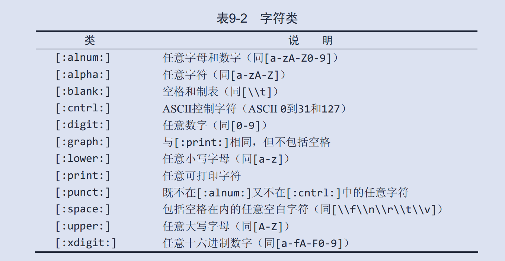
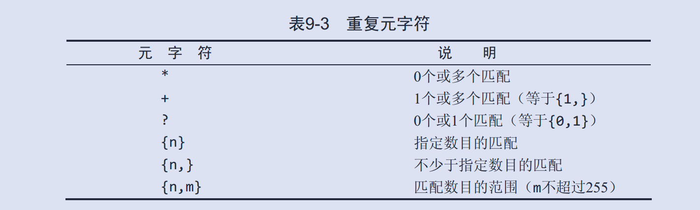

## 前言

1️⃣  ：[mysql环境准备](https://blog.csdn.net/sinat_38816924/article/details/105478479)

:two:  ：[简单的表查询](https://blog.csdn.net/sinat_38816924/article/details/105718525)

第一部分：我们准备环境：安装数据库+创建数据库+创建用户+授权。

第二部分：环境准备好后，进行简单的单表查询：导入表+表查询。

现在是第三部分：参考《sql必知必会》chapter8~9，**通配符+正则表达式**。

之前where操作符，使用已知的值，进行过滤不够强。所以需要加上通配符buff。通配符不够强，需要正则表达式红buff。

缺点：文中的举例较少。

---

[toc]

## 摘要与总结

通配符和正则表达式，增强了`where`语句的过滤能力。

通配符和正则表达式是两个东西。他们的功能分别是匹配、筛选。

使用通配符的语句，匹配整个语句。

使用正则的语句，在列值内进行匹配。

<br>

<br>

## Mysql通配符

* `%`:表示任何字符出现任意次数

* `_`:下划线只匹配单个字符而不是多个字符。

* `LIKE`:为在搜索子句中使用通配符，必须使用LIKE操作符。 LIKE指示MySQL，后跟的搜索模式**利用通配符匹配而不是直接相等匹配进行比较**。

  ```mysql
  # 虽然比较简单，这里还是给一个例子
  #　s开头e结尾文本
  mysql> SELECT prod_name FROM products
  			WHERE prod_name LIKE 's%e';
  ```

  > 通配符搜索的处理一般要比前面讨论的其他搜索所花时间更长。
  >
  > 在确实需要使用通配符时，除非绝对有必要，否则不要把它们用在搜索模式的开始处。把通配符置于搜索模式的开始处，搜索起来是最慢的。

<font color=red>值得注意的是：`LIKE`匹配整个列。即使被匹配的文本在列值中出现， LIKE将不会找到它</font>

<br>

<br>

## 正则表达式

但是光有通配符是不够滴。比如我们希望筛选出文本中的电话号码这时候得配合正则表达式。

(**正则相对上面的统配符来说，没啥关系**)正则表达式用正则表达式语言来建立。与任意语言一样，正则表达式具有你必须学习的特殊的语法和指令。

<font color=red>`REGEXP`在列值内进行匹配，如果被匹配的文本在列值中出现， `REGEXP`将会找到它，相应的行将被返回。</font>

### 基本字符匹配

* `.`：它表示匹配任意一个字符

* `|`：正则表达式的OR操作符。它表示匹配其中之一（REGEXP '1000|2000'）

* `[]`：匹配几个字符之一 （REGEXP '[12]000'）[]匹配的是单个字符1，并不是12

  这里稍微说下`[]`　通配符。

  REGEXP '[12]000'）[]匹配的是**单个字符**1或者２；

  它等价	'[1|2]000'　；

  但是得有括号。要是没有括号，'1|2000',就变成1或者2000，而不是1000，,2000；

  那<font color=red>如何匹配多字符？</font>这样写没用--》'[12|23]000'==[1|2|2|3]000';

  没办法的话，这么写1000|2000；[]是来简化|;

* `\\` ：匹配特殊字符。

  > \\为前导多数正则表达式实现使用单个反斜杠转义特殊字符，以便能使用这些字符本身。但MySQL要求两个反斜杠（ MySQL自己解释一个，正则表达式库解释另一个）

* 定位符：`$`　、`^`

<br>

### 匹配字符类



<font color=blue>准确来说：[:digit:]代表0-9，不是代表[0-9]　；不然没法理解</font>

```mysql
# 搜索连续四个数字的文本
[[:digit:]]{4}
# 它等价于
[0-9][0-9][0-9][0-9]
```

<br>

### 匹配多实例




目前为止，这些正则判断，都是对单个字符的一个或多个判断；并没有同时将多个字符作为整体判断：比如：前四个数字相同文本判断。

最后：通配符实现的功能，正则表达式都可以实现

<br>

<br>

## 其他

一个思考:question:

**我和正则表达式这个家伙不熟。**

第八章章节名是：用通配符进行**过滤**；第九章章节名是：使用正则表达式进行**搜索**。

可以看到它们用的关键字不同。我们不经会思考：<font color=blue>通配符和正则表达式底层的支撑不同?</font>:thinking:

通过上面，**我们知道通配符和正则是两个东西，没啥关系**，虽然它们都用了一些符号。

但，它们究竟是如何实现过滤/搜索了。

我搜了下，没看。

[正则表达式里的底层原理是什么](https://www.cnblogs.com/Renyi-Fan/p/9694695.html)

<br>

<br>

## 参考汇总

[正则表达式里的底层原理是什么](https://www.cnblogs.com/Renyi-Fan/p/9694695.html)

[Mysql去除特殊符号](http://www.wenfeifei.com/art/detail/4JAqD0g)

[MySQL使用正则表达式进行查询操作经典实例总结](http://www.uxys.com/html/MySQL/20180704/69620.html)